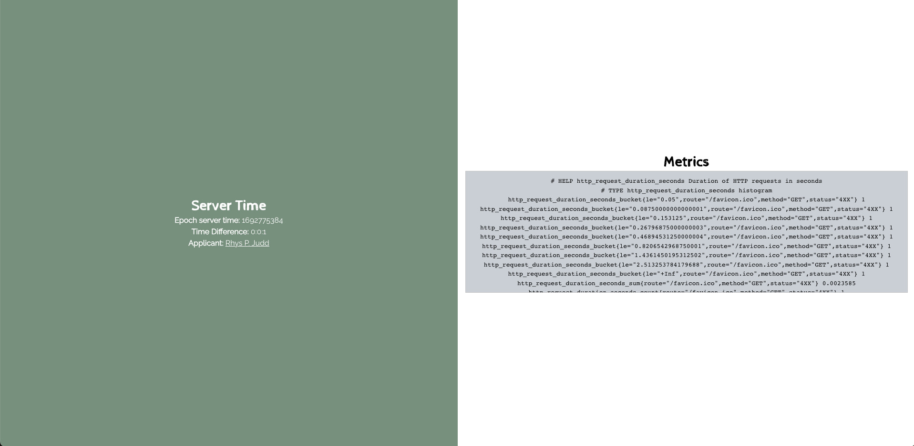

# Connexone - Node/Express/React - Epoch/Metrics API



## Installation

Git clone repo

To run the server

```bash
  cd express-api
  npm install
  npm start
```
**Server proxy:** Port 77777

To run the client (react app)

```bash
  cd client
  npm install
  node server.js
  npm start
```
**Client proxy:** Port 3000

Open app (http://localhost:3000)
     
# Build Process

**Requirement analysis**

Understand the project requirements by studying the provided specifications for both the API and frontend application. Identify the key features, endpoints, data formats, and user interactions outlined in the specifications. Determine the required technologies and packages for both the backend (API) and frontend.

**Design**

Design the architecture for both the API and frontend application. Plan how the different components will interact with each other. Define the structure of API endpoints, request and response data formats, and data flow within the frontend components.

**Implementation**

Install dependencies via NPM and create project structure. Implement the endpoints /time and /metrics, along with the authorization logic. Develop the frontend application using React, following the specified layout and UI elements. Implement data fetching, calculations for server time differences, and rendering of the preformatted metrics.

**Testing**
Perform testing at various levels:

- Unit Testing: Test individual functions and components to ensure they work correctly.
- Integration Testing: Test the interactions between different components and modules.

**Deployment**
Host the source code on a version control platform ie. GitHub. Ensure the repository is well-organized and documented with a readme for others to understand and contribute. 

## Tech Stack

**Client:** React, TailwindCSS, React Spinners (for loader animation)

**Server:** Node, Express, Prometheus Middleware

## Authors

- [@rhyspjudd-dev](https://github.com/rhyspjudd-dev)
- Rhys P. Judd [website](https://rpj-dev.netlify.app/)

